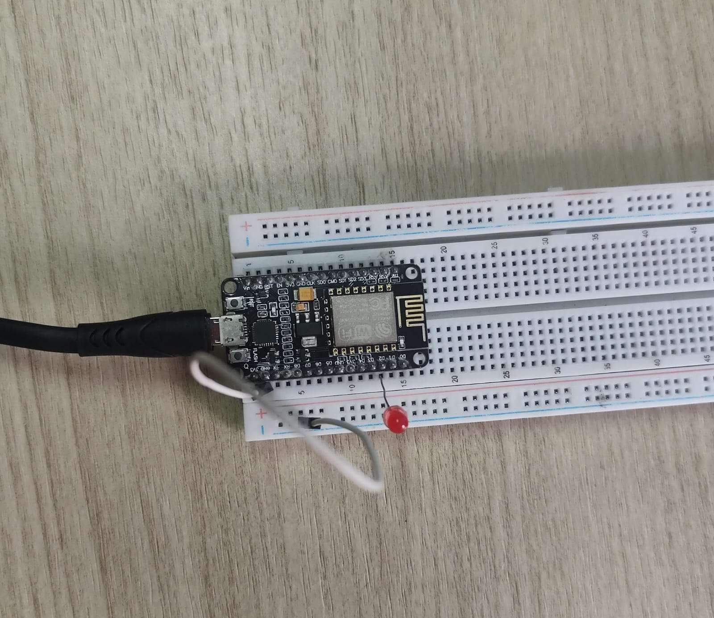
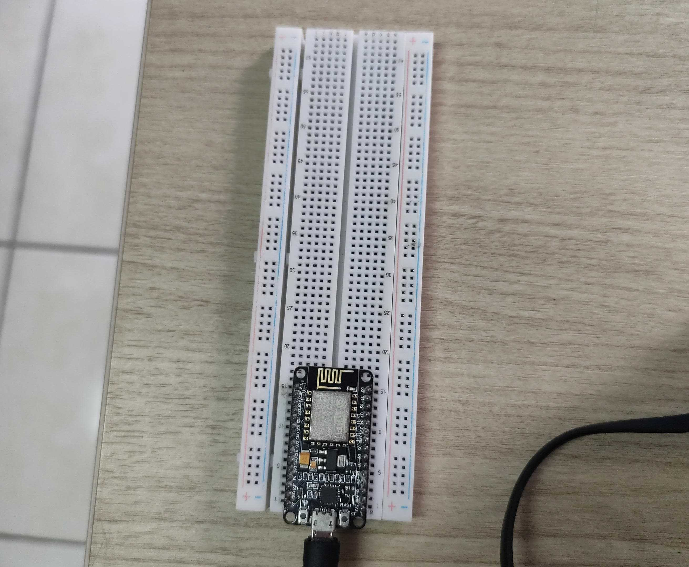

# Modul 2 - Konfigurasi Jaringan

> [!IMPORTANT]
> Memahami bagaimana mengkonfigurasikan WiFi ESP sebagai Station(STA), Access Point (AP) atau keduanya STA + AP

## Isi Dari README.md Ini

- [Library (Yang digunakan)](#library)
- [Percobaan (Kode asli, Penjelasannya)](#percobaan-praktikum)
- [Pertanyaan Praktikum (Source Code, Penjelasan)](#pertanyaan-praktikum)
- [Dokumentasi](#dokumentasi)

## Library

Libary yang diperlukan untuk

- ESP8266WiFi.h: library untuk berinteraksi dengan WiFi

## Percobaan Praktikum

### Percobaan 2A

`File : ./Code/Percobaan2A.cpp`

```cpp
#include <ESP8266WiFi.h>

const char *ssid = "personalX"; // SSID / Nama WiFi
const char *password = "177013003"; // Password WiFi

const int ledPin = 4; // LED indikator status koneksi

void setup()
{
    Serial.begin(115200);
    pinMode(ledPin, OUTPUT);
    digitalWrite(ledPin, LOW);

    // Set mode WiFi menjadi Station
    WiFi.mode(WIFI_STA);
    WiFi.begin(ssid, password); // Memulai WiFi STA yang akan terhubung sesuai dengan ssid dan password
    WiFi.setHostname("Test"); // Mengubah nama perangkat WiFi ESP saat terhubung ke hotspot

    Serial.print("Menghubungkan ke WiFi");
    while (WiFi.status() != WL_CONNECTED) // Mengecek status WiFi, apakah masih konekting atau sudah konek
    { // Jika konekting, akan menampilkan '.'
        delay(500);
        Serial.print(".");
    }

    // Jika berhasil terhubung
    // Menampilkan IP addr, MAC addr, RSSI
    Serial.println();
    Serial.println("WiFi berhasil terhubung!");
    Serial.print("IP Address  : ");
    Serial.println(WiFi.localIP());
    Serial.print("MAC Address : ");
    Serial.println(WiFi.macAddress());
    Serial.print("RSSI (dBm)  : ");
    Serial.println(WiFi.RSSI());

    digitalWrite(ledPin, HIGH); // nyalakan LED sebagai indikator
}

void loop()
{
    // Cek status koneksi setiap 5 detik
    if (WiFi.status() == WL_CONNECTED) // Mengecek status WiFI saat ini
    { // Jika masih terhubung, tampilkan IP addr, MAC addr dan RSSI
        Serial.println("\nStatus: Terhubung");

        // Mengecek status WiFi saat loop
        Serial.print("IP Address  : ");
        Serial.println(WiFi.localIP());
        Serial.print("MAC Address : ");
        Serial.println(WiFi.macAddress());
        Serial.print("RSSI (dBm)  : ");
        Serial.println(WiFi.RSSI());
    }
    else
    { // Jika tidak, tampilkan status terputus dan mematikan LED
        Serial.println("Status: Terputus");
        digitalWrite(ledPin, LOW);
    }
    delay(5000); // Jeda 5 detik
}
```

### Percobaan 2B

`File : ./Code/Percobaan2B.cpp`

```cpp
#include <ESP8266WiFi.h>

const char *ap_ssid = "ESP32_AccessPointc"; // Nama Access Point ESP
const char *ap_password = "12345678"; // minimal 8 karakter, password Access Point ESP

void setup()
{
    Serial.begin(115200);

    // Set mode WiFi menjadi Access Point
    // Mengatur SSID dan password AP
    WiFi.mode(WIFI_AP);
    WiFi.softAP(ap_ssid, ap_password);

    // Menampilkan SSID dan IP addr dari Access Point
    IPAddress apIP = WiFi.softAPIP();
    Serial.println("Access Point aktif!");
    Serial.print("SSID          : ");
    Serial.println(ap_ssid);
    Serial.print("IP Address    : ");
    Serial.println(apIP);
}

void loop()
{
    // Menampilkan jumlah perangkat yang terhubung setiap 5 detik
    int jumlahClient = WiFi.softAPgetStationNum();
    Serial.print("Jumlah perangkat terhubung: ");
    Serial.println(jumlahClient);
    delay(5000);
}
```

## Pertanyaan Praktikum

### Percobaan 2A - Modifikasi program agar ESP32 mencoba menghubungkan ulang (reconnect) secara otomatis apabila koneksi WiFi terputus

`File : ./Code/Percobaan2A-Answer.cpp`

```cpp
#include <ESP8266WiFi.h>

const char *ssid = "Your-SSID";
const char *password = "Your-Password";

const int ledPin = 2;

void setup()
{
    Serial.begin(115200);
    pinMode(ledPin, OUTPUT);
    digitalWrite(ledPin, LOW);

    WiFi.mode(WIFI_STA);
    WiFi.begin(ssid, password);
    WiFi.setHostname("ESP STA");
    WiFi.setAutoReconnect(true);

    Serial.print("Menghubungkan ke WiFi");
    while (WiFi.status() != WL_CONNECTED)
    {
        delay(500);
        Serial.print(".");
    }

    Serial.println();
    Serial.println("WiFi berhasil terhubung!");
    Serial.print("IP Address  : ");
    Serial.println(WiFi.localIP());
    Serial.print("MAC Address : ");
    Serial.println(WiFi.macAddress());
    Serial.print("RSSI (dBm)  : ");
    Serial.println(WiFi.RSSI());

    digitalWrite(ledPin, HIGH);
}

void loop()
{
    if (WiFi.status() == WL_CONNECTED)
    {
        Serial.println("\nStatus: Terhubung");
    }
    else
    {
        Serial.println("Status: Terputus");
        digitalWrite(ledPin, LOW);
    }

    Serial.print("IP Address  : ");
    Serial.println(WiFi.localIP());
    Serial.print("MAC Address : ");
    Serial.println(WiFi.macAddress());
    Serial.print("RSSI (dBm)  : ");
    Serial.println(WiFi.RSSI());
    delay(5000);
}
```

**Penjelasan**

1. Mengubah Hostname dari perangkat ESP8266 agar mudah di lihat(biar ga MAC address doank yang tampil)

```cpp
WiFi.setHostname("ESP STA");
```

2. Mengatur agar WiFi auto reconnect

```cpp
WiFi.setAutoReconnect(true);
```

### Percobaan 2B - Modifikasi program agar ESP32 berjalan pada mode AP+STA (terhubung ke WiFirumah sekaligus menyediakan Access Point)

`File : ./Code/Percobaan2B-Answer.cpp`

```cpp
#include <ESP8266WiFi.h>

const char *ap_ssid = "ESP32_AccessPoint";
const char *ap_password = "12345678";

const char *sta_ssid = "your-ssid";
const char *sta_password = "your-password";

void setup()
{
    Serial.begin(115200);

    WiFi.mode(WIFI_AP_STA);
    WiFi.setHostname("ESP AP+STA");
    WiFi.begin(sta_ssid, sta_password);

    Serial.print("Menghubungkan ke WiFi");
    while (WiFi.status() != WL_CONNECTED)
    {
        delay(500);
        Serial.print(".");
    }

    if (WiFi.status() == WL_CONNECTED)
    {
        Serial.println("\nTerhubung ke WiFi!");
        Serial.print("IP Station: ");
        Serial.println(WiFi.localIP());
    }

    WiFi.softAP(ap_ssid, ap_password);
    IPAddress apIP = WiFi.softAPIP();
    Serial.println("Access Point aktif!");
    Serial.print("IP Address    : ");
    Serial.println(apIP);
}

void loop()
{
    static unsigned long lastPrint = 0;

    if (millis() - lastPrint >= 5000)
    {
        lastPrint = millis();

        Serial.println("\n=== STATUS ===");

        // Status Station
        Serial.print("WiFi: ");
        if (WiFi.status() == WL_CONNECTED)
        {
            Serial.println("Terhubung");
            Serial.print("IP: ");
            Serial.println(WiFi.localIP());
        }
        else
        {
            Serial.println("Tidak terhubung");
        }

        // Status AP
        int clients = WiFi.softAPgetStationNum();
        Serial.print("AP Clients: ");
        Serial.println(clients);
    }

    delay(100);
}
```

**Penjelasan**

1. Menambahkan variabel ssid dan password untuk STA

```cpp
const char *sta_ssid = "your-ssid";
const char *sta_password = "your-password";
```

2. Mengubah Hostname dari perangkat ESP8266 agar mudah di lihat(biar ga MAC address doank yang tampil)

```cpp
WiFi.setHostname("ESP AP+STA");
```

3. Memulai WiFi STA yang akan terhubung ke ssid dan memasukan password

```cpp
WiFi.begin(sta_ssid, sta_password);
```

4. Looping sampai status WiFi terhubung

```cpp
Serial.print("Menghubungkan ke WiFi");
while (WiFi.status() != WL_CONNECTED)
{
    delay(500);
    Serial.print(".");
}
```

5. Jika status sudah terhubung maka tampilkan IP client dari ESP

```cpp
if (WiFi.status() == WL_CONNECTED)
{
    Serial.println("\nTerhubung ke WiFi!");
    Serial.print("IP Station: ");
    Serial.println(WiFi.localIP());
}
```

6. Menambahkan variabel untuk menyimpan data millis kapan terakhir melakukan print ke layar

```cpp
static unsigned long lastPrint = 0;
```

7. Mengecek apakah waktu(millis) sekarang dikurangi variabel lastPrint sudah lebih dari 5000ms/5s

```cpp
if (millis() - lastPrint >= 5000)
```

8. Jika iya, maka akan mengatur ulang nilai lastPrint menjadi waktu sekarang dan akan menampilkan status WiFi seperti apakah ESP masih terhubung dengan Access Point dan juga menampilkan beberapa perangkat(client) yang terhubung dengan AP ESP

```cpp
lastPrint = millis();

Serial.println("\n=== STATUS ===");

// Status Station
Serial.print("WiFi: ");
if (WiFi.status() == WL_CONNECTED)
{
    Serial.println("Terhubung");
    Serial.print("IP: ");
    Serial.println(WiFi.localIP());
}
else
{
    Serial.println("Tidak terhubung");
}

// Status AP
int clients = WiFi.softAPgetStationNum();
Serial.print("AP Clients: ");
Serial.println(clients);
```

9. Jeda 0.1s

```cpp
delay(100);
```

## Dokumentasi

**Percobaan 2A**



**Percobaan 2B**


