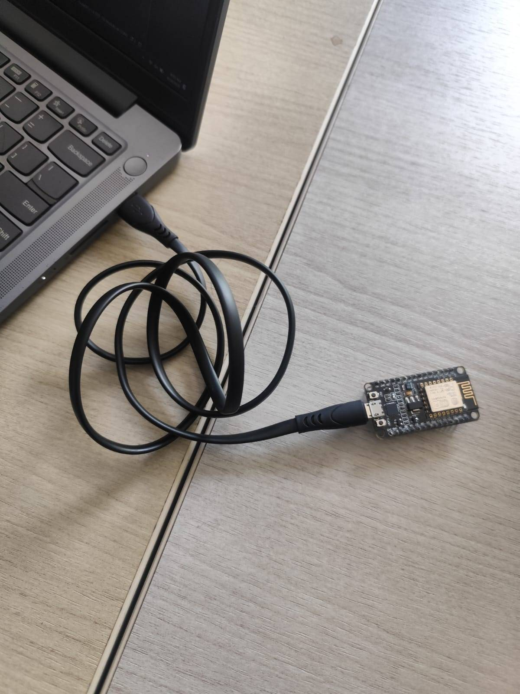
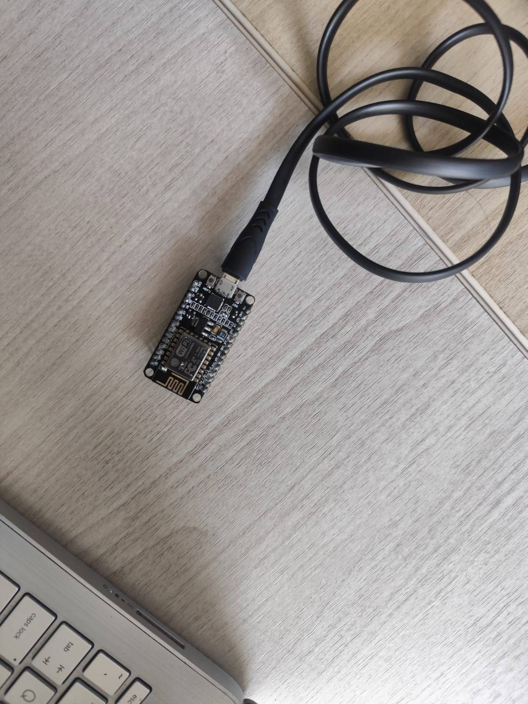

# Modul 3 - Protokol Komunikasi IoT

> [!IMPORTANT]
> Praktikum kali ini bertujuan untuk melakukan pengujian tentang komunikasi pada Iot dengan menggunakan protokol HTTP dan juga MQTT menggunakan representasi data berupa JSON menggunakan koneksi WiFi untuk dapat mengakses endpoint dan broker yang digunakan.

## Isi Dari README.md Ini

- [Library (Yang digunakan)](#library)
- [Percobaan (Kode asli, Penjelasannya)](#percobaan-praktikum)
- [Pertanyaan Praktikum (Source Code, Penjelasan)](#pertanyaan-praktikum)
- [Dokumentasi](#dokumentasi)

## Library

Libary yang diperlukan untuk

- ESP8266WiFi.h: digunakan untuk berinteraksi dengan WiFi
- WiFiClientSecure.h: digunakan komunikasi HTTPS/TLS
- PubSubClient.h: digunakan untuk komunikasi MQTT
- ArduinoJson.h: digunakan untuk serialize dan deserialize JSON

## Percobaan Praktikum

### Percobaan 3A

`File : ./Code/Percobaan3A.cpp`

```cpp
#include <ESP8266WiFi.h> // Library untuk berinteraksi dengan wifi
#include <ESP8266HTTPClient.h> // Library untuk komunikasi http
#include <WiFiClientSecure.h> // library untuk komunikasi https
#include <ArduinoJson.h> // library untuk serialize dan deserialize JSON

const char *ssid = "wifi-anda"; // nama wifi
const char *password = "password"; // password wifi
const char *serverUrl = "https://httpbin.org/post"; // endpoint yang dituju

void setup() {
    Serial.begin(115200); // memulai port 115200 untuk komunikasi serial

    WiFi.begin(ssid, password); // memulai wifi

    Serial.print("Menghubungkan ke WiFi");
    while (WiFi.status() != WL_CONNECTED) { // terus  menampilkan ‘.’ sebelum sukses konek
        delay(500);
        Serial.print(".");
    }
    Serial.println();
    Serial.println("WiFi berhasil terhubung!");
}

void loop() {
    if (WiFi.status() == WL_CONNECTED) { // mengecek apakah wifi sudah terhubung atau belum
        HTTPClient http; // membuat instance komunikasi http
        WiFiClientSecure client; // membuat client untuk koneksi https
        client.setInsecure(); // menonaktifkan pemeriksaan sertifikat SSL/TLS

        http.begin(client, serverUrl); // menyiapkan koneksi http
        http.addHeader("Content-Type", "application/json"); // menambahkan header tipe konten yang akan dikirim yaitu JSON

        JsonDocument doc; // payload yang akan dikirim
        doc["suhu"] = 28.5; // menambahkan data suhu ke payload
        doc["kelembaban"] = 65.0; // menambahkan data kelembaban ke payload

        String requestBody; // penampung payload yang telah di stringify
        serializeJson(doc, requestBody); // serializing JSON menjadi string

        Serial.print("Mengirim data: ");
        Serial.println(requestBody); // menampilkan hasil serialize

        int httpResponseCode = http.POST(requestBody); // melakukan request POST yang berisi payload ke endpoint

        if (httpResponseCode > 0) { // jika http status lebih besar dari 0, maka tampilkan status kode dan isi response
            Serial.print("Kode Respon HTTP: ");
            Serial.println(httpResponseCode);
            Serial.println("Isi Respon:");
            Serial.println(http.getString());
        } else { // tampilkan error kode saat http status < 0
            Serial.print("Pengiriman gagal, kode error: ");
            Serial.println(httpResponseCode);
        }
        http.end(); // menutup komunikasi http
    }

    delay(10000); // jeda 10 detik
}
```

### Percobaan 3B

`File : ./Code/Percobaan3B.cpp`

```cpp
#include <ESP8266WiFi.h> // library untuk berkomunikasi dengan wifi
#include <WiFiClientSecure.h> // library untuk komunikasi https/tls
#include <PubSubClient.h> // library untuk komunikasi mqtt
#include <ArduinoJson.h> // library untuk serialize dan deserialize JSON

const char *ssid = "nama-wifi"; // nama wifi
const char *password = "password"; // password wifi
const char *mqttServer = "mqtt.server"; // hostname server mqtt
const int mqttPort = 8883; // port mqtt

const char *mqttUsername = "test"; // username client mqtt
const char *mqttPassword = "12345678"; // password client mqtt
const char *mqttTopic = "test/sensor"; // topik yang data yang akan dikirim

WiFiClientSecure espClient; // instance client
PubSubClient client(espClient); // instance mqtt

void hubungkanWiFi() { // fungsi untuk koneksi wifi
    WiFi.begin(ssid, password); // menghubungkan koneksi wifi
    Serial.print("Menghubungkan ke WiFi");
    while (WiFi.status() != WL_CONNECTED) { // terus  menampilkan ‘.’ sebelum sukses konek
        delay(500);
        Serial.print(".");
    }

    Serial.println();
    Serial.println("WiFi berhasil terhubung!");

    Serial.print("IP Address: ");
    Serial.println(WiFi.localIP()); // menampilkan IP ESP
}

void hubungkanMQTT() {
    while (!client.connected()) { // terus mengecek koneksi mqtt, jika konek maka jalankan kode didalamnya
        Serial.println();
        Serial.print("Menghubungkan ke broker MQTT...");

        String clientId = "ESP8266Client-" + String(ESP.getChipId(), HEX); // nama unik client

        Serial.print(" Client ID: ");
        Serial.println(clientId); // menampilkan nama unik client

        if (client.connect(clientId.c_str(), mqttUsername, mqttPassword)) {
            // kode didalam akan dijalankan jika sudah konek ke broker mqtt berdasarkan password dan username
            Serial.println("MQTT berhasil terhubung!");

            Serial.print("Broker : ");
            Serial.println(mqttServer); // menampilkan broker

            Serial.print("Port   : ");
            Serial.println(mqttPort); // menampilkan port

            Serial.println("================================");
        } else { //menampilkan pesan error saat tidak dapat terhubung ke broker
            Serial.print("MQTT gagal, rc=");
            Serial.println(client.state()); // menampilkan kode status mqtt
            Serial.println("Mencoba lagi dalam 2 detik...");
            delay(2000); // jeda 2 detik
        }
    }
}

void setup() {
    Serial.begin(115200); // membuka serial port 115200

    delay(1000);
    Serial.println();
    Serial.println(" ESP8266 MQTT - HiveMQ Cloud");
    Serial.println("================================");
    hubungkanWiFi(); // menjalankan fungsi hubungkanWiFi
    espClient.setInsecure(); // menonaktifkan pemeriksaan sertifikat SSL/TLS
    client.setServer(mqttServer, mqttPort); // menyiapkan koneksi ke broker mqtt

    hubungkanMQTT(); // menjalankan fungsi hubungkanMQTT
}

void loop() {
    if (!client.connected()) { // melakukan koneksi ulang ke brokerMQTT jika koneksi terputus
        Serial.println();
        Serial.println("MQTT terputus!");
        hubungkanMQTT();
    }

    client.loop(); // menjaga dan menangani  koneksi mqtt

    JsonDocument doc; // menyiapkan payload
    doc["suhu"] = 28.5; // menambahkan data suhu ke payload
    doc["kelembaban"] = 65.0; // menambahkan data kelembaban ke payload

    char buffer[128]; // variabel string buffer untuk payload
    serializeJson(doc, buffer); // stringify JSON

    bool berhasil = client.publish(mqttTopic, buffer); // melakukan publish ke topik
    if (berhasil) { // saat berhasil, akan menampilkan status, topik dan payload yang telah dikirim
        Serial.println();
        Serial.println("Data berhasil dikirim!");

        Serial.print("Topic   : ");
        Serial.println(mqttTopic);
        Serial.print("Payload : ");
        Serial.println(buffer);
    } else { // menampilkan pesan error saat gagal publish
        Serial.println();
        Serial.println("Gagal mengirim data!");
    }

    delay(5000); // jeda 5 detik
}
```

## Pertanyaan Praktikum

### Percobaan 3A - Modifikasi program agar ESP32 dapat mengirimkan data tambahan berupa waktu (dalam milidetik sejak dinyalakan menggunakan millis()) ke dalam JSON yang dikirim, dan berikan penjelasan di setiap baris kode yang ditambahkan

`File : ./Code/Percobaan3A-Answer.cpp`

```cpp
#include <ESP8266WiFi.h>
#include <ESP8266HTTPClient.h>
#include <WiFiClientSecure.h>
#include <ArduinoJson.h>

const char *ssid = "nama-wifi";
const char *password = "password";
const char *serverUrl = "https://httpbin.org/post";

void setup() {
    Serial.begin(115200);

    WiFi.begin(ssid, password);

    Serial.print("Menghubungkan ke WiFi");
    while (WiFi.status() != WL_CONNECTED) {
        delay(500);
        Serial.print(".");
    }
    Serial.println();
    Serial.println("WiFi berhasil terhubung!");
}

void loop() {
    if (WiFi.status() == WL_CONNECTED) {
        HTTPClient http;
        WiFiClientSecure client;
        client.setInsecure();

        http.begin(client, serverUrl);
        http.addHeader("Content-Type", "application/json");

        JsonDocument doc;
        doc["suhu"] = 28.5;
        doc["kelembaban"] = 65.0;
        doc["uptime"] = millis();

        String requestBody;
        serializeJson(doc, requestBody);

        Serial.print("Mengirim data: ");
        Serial.println(requestBody);

        int httpResponseCode = http.POST(requestBody);

        if (httpResponseCode > 0) {
            Serial.print("Kode Respon HTTP: ");
            Serial.println(httpResponseCode);
            Serial.println("Isi Respon:");
            Serial.println(http.getString());
        } else {
            Serial.print("Pengiriman gagal, kode error: ");
            Serial.println(httpResponseCode);
        }

        http.end();
    }

    delay(10000);
}
```

**Penjelasan**

1. Membuat instance client

```cpp
WiFiClientSecure client;
```

2. Mengkonfigurasi agar menonaktifkan pemeriksaan sertifikat SSL/

```cpp
client.setInsecure();
```

3. Menambahkan data uptime ke payload

```cpp
doc["uptime"] = millis();
```

## Dokumentasi

**Percobaan 3A**



**Percobaan 3B**


