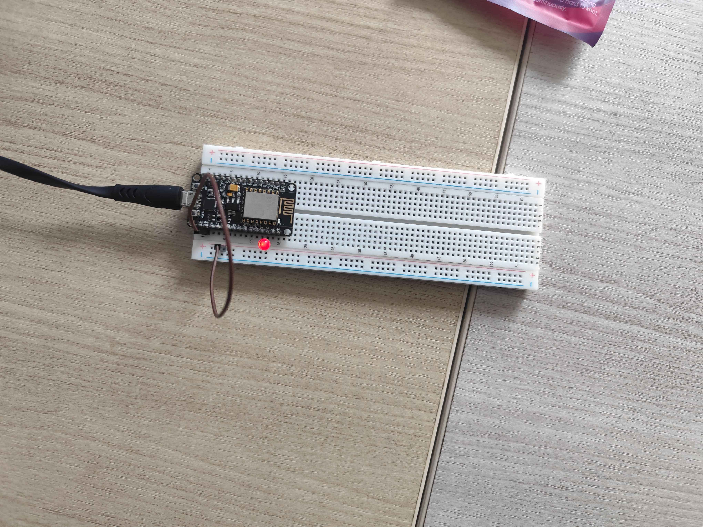
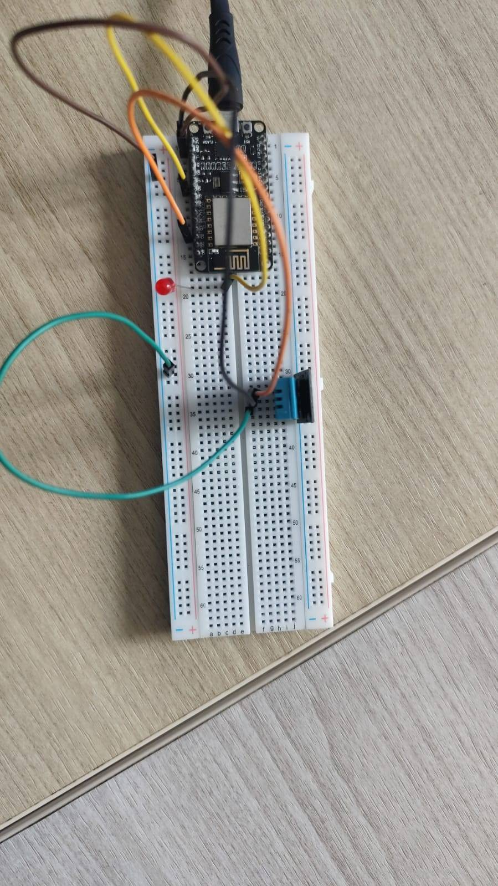

# Modul 4 - Komunikasi Pertukaran Data

> [!IMPORTANT]
> Praktikum kali ini bertujuan untuk memahami pertukaran data dua arah pada sistem Iot, memahami mekanisme subscribe dan proses deserialisasi JSON, mengimplementasikan penerimaan perintah kendali melalui MQTT untuk menggerakkan aktuator secara real-time serta Mengimplementasikan sistem IoT yang dapat mempublikasikan data sensor dan menerima perintah kendali secara bersamaan (full duplex)

## Isi Dari README.md Ini

- [Library (Yang digunakan)](#library)
- [Percobaan (Kode asli, Penjelasannya)](#percobaan-praktikum)
- [Pertanyaan Praktikum (Source Code, Penjelasan)](#pertanyaan-praktikum)
- [Dokumentasi](#dokumentasi)

## Library

Libary yang diperlukan untuk

- ESP8266WiFi.h: digunakan untuk berinteraksi dengan WiFi
- WiFiClientSecure.h: digunakan komunikasi HTTPS/TLS
- PubSubClient.h: digunakan untuk komunikasi MQTT
- ArduinoJson.h: digunakan untuk serialize dan deserialize JSON

## Percobaan Praktikum

### Percobaan 4A

`File : ./Code/Percobaan4A.cpp`

```cpp
#include <ESP8266WiFi.h>
#include <WiFiClientSecure.h>
#include <PubSubClient.h>
#include <ArduinoJson.h>

const char *ssid = "nama-wifi"; // nama wifi
const char *password = "password"; // password wifi
const char *mqttServer = "broker.hivemq.com"; // host broker
const int mqttPort = 8883; // port broker
const char *topicPerintah = "test/sensor"; // topik

const char *mqttUsername = "test"; // Username broker
const char *mqttPassword = "12345678"; // password broker
const int ledPin = 4; // pin LED
WiFiClientSecure espClient; // instance wifi esp

PubSubClient client(espClient); // instance client mqtt

// Fungsi callback dipanggil otomatis setiap ada pesan baru masuk
void callback(char *topic, byte *payload, unsigned int length) {
    String pesan;
    for (unsigned int i = 0; i < length; i++)
        pesan += (char)payload[i]; // membaca pesan yang masuk

    // Menampilkan topik dan isi pesan
    Serial.print("Pesan diterima [");
    Serial.print(topic);
    Serial.print("]: ");
    Serial.println(pesan);
    // Deserialisasi data JSON yang diterima
    JsonDocument doc;
    DeserializationError error = deserializeJson(doc, pesan);
    if (error) { // jika terjadi error saat deserialize, tampilkan error
        Serial.print("Gagal parsing JSON: ");
        Serial.println(error.c_str());
        return;
    }
    const char *perintah = doc["perintah"];
    if (String(perintah) == "ON") { // nyalakan LED jika data perintah on
        digitalWrite(ledPin, HIGH);
        Serial.println("Aktuator: ON");
    }
    else if (String(perintah) == "OFF") { // matikan LED jika data perintah off
        digitalWrite(ledPin, LOW);
        Serial.println("Aktuator: OFF");
    }
}

// Fungsi untuk mengkoneksikan wifi
void hubungkanWiFi() {
    WiFi.begin(ssid, password); // menghubungkan ke wifi
    Serial.print("Menghubungkan ke WiFi");
    while (WiFi.status() != WL_CONNECTED) { // menampilkan ‘.’ jika belum terkoneksi
        delay(500);
        Serial.print(".");
    }
    Serial.println("\nWiFi berhasil terhubung!"); // jika sukses terhubung
}

// Fungsi untuk mengkoneksikan MQTT
void hubungkanMQTT() {
    while (!client.connected()) { // looping sampai dapat terhubung ke broker
        Serial.print("Menghubungkan ke broker MQTT...");
        String clientId = "ESP32Client-" + String(random(0xffff), HEX); // nama client

        // Melakukan login, nama client, username, password
        if (client.connect(clientId.c_str(), mqttUsername, mqttPassword)) {
            // Tampilkan pesan sukses dan subscribe topik
            Serial.println("berhasil terhubung!");
            client.subscribe(topicPerintah); // subscribe setelah berhasil terhubung
            Serial.print("Subscribe ke topic: ");
            Serial.println(topicPerintah);
        }
        else { // tampilkan pesan error jika gagal dan mencoba ulang setelah 2 detik
            Serial.print("gagal, rc=");
            Serial.print(client.state());
            Serial.println(" coba lagi dalam 2 detik");
            delay(2000);
        }
    }
}

void setup() {
    espClient.setInsecure(); // set agar dapat menggunakan koneksi tls
    Serial.begin(115200); // memulai serial
    pinMode(ledPin, OUTPUT); // mengatur pin LED sebagai output
    digitalWrite(ledPin, LOW); // mematikan LED sebagai nilai awal
    hubungkanWiFi(); // memulai koneksi wifi
    client.setServer(mqttServer, mqttPort); // mengatur koneksi MQTT
    client.setCallback(callback); // daftarkan fungsi callback
}
void loop() {
    if (!client.connected()) // reconnect jika koneksi dengan mqtt terputus
        hubungkanMQTT();
    client.loop(); // wajib dipanggil terus-menerus agar pesan dapat diterima
}
```

### Percobaan 4B

`File : ./Code/Percobaan4B.cpp`

```cpp
#include <ESP8266WiFi.h>
#include <PubSubClient.h>
#include <WiFiClientSecure.h>
#include <ArduinoJson.h>
#include <DHT.h>

const char *ssid = "nama-wifi"; // nama wifi
const char *password = "password"; // password wifi
const char *mqttServer = "broker.hivemq.com"; // host broker
const int mqttPort = 8883; // port broker
const char *topicData = "test/data"; // topik untuk data
const char *topicPerintah = "test/sensor"; // topik untuk perintah

const char *mqttUsername = "test"; // username user
const char *mqttPassword = "12345678"; // password user

#define DHTPIN 2 // pin dht
#define DHTTYPE DHT11 // tipe dht
const int ledPin = 12; // pin LED

DHT dht(DHTPIN, DHTTYPE); // instance dht

WiFiClientSecure espClient; // instance client wifi
PubSubClient client(espClient); // instance client mqtt
unsigned long waktuTerakhirPublish = 0; // terakhir kali mengirim data, number
const long intervalPublish = 5000; // publish data setiap 5 detik(non - blocking)

// fungsi yang akan di panggil saat pesan masuk
void callback(char *topic, byte *payload, unsigned int length) {
    // membaca pesan masuk
    String pesan;
    for (unsigned int i = 0; i < length; i++)
        pesan += (char)payload[i];

    // Deserialize payload
    JsonDocument doc;
    if (deserializeJson(doc, pesan))
        return; // abaikan jika parsing gagal
    const char *perintah = doc["perintah"]; // ambil data perintah
    digitalWrite(ledPin, String(perintah) == "ON" ? HIGH : LOW); // nyalakan atau matikan berdasarkan perintah
    Serial.print("Perintah diterima -> Aktuator: "); // tampilkan perintah
    Serial.println(perintah);
}

// Fungsi untuk menyalakan koneksi wifi
void hubungkanWiFi() {
    WiFi.begin(ssid, password); // menghubungkan ke wifi
    while (WiFi.status() != WL_CONNECTED) // loop sampai dapat terhubung
        delay(500);
    Serial.println("WiFi berhasil terhubung!"); // tampilkan pesan sukses
}

// Fungsi untuk mengkoneksikan mqtt
void hubungkanMQTT() {
    while (!client.connected()) { // looping sampai koneksi mqtt dapat terhubung
        String clientId = "ESP32Client-" + String(random(0xffff), HEX); // nama client

        // Melakukan login, nama client, username, password
        if (client.connect(clientId.c_str(), mqttUsername, mqttPassword)) {
            // Melakukan subscribe ke topik jika berhasil konek
            client.subscribe(topicPerintah);
            Serial.println("Terhubung dan subscribe topic perintah");
        } else { // mencoba koneksi lagi setelah jeda 2 detik
            delay(2000);
        }
    }
}

void setup() {
    espClient.setInsecure(); // set agar bisa menggunakan koneksi tls
    Serial.begin(115200); // memulai serial
    pinMode(ledPin, OUTPUT); // mengatur pin LED sebagai output
    dht.begin(); // memulai dht
    hubungkanWiFi(); // menyalakan wifi
    client.setServer(mqttServer, mqttPort); // mengatur koneksi mqtt
    client.setCallback(callback); // mengatur callback saat pesan masuk
}

void loop() {
    if (!client.connected()) // menghubungkan kembali koneksi mqtt jika terputus
        hubungkanMQTT();
    client.loop(); // memproses pesan masuk secara terus-menerus
    // Publish data sensor secara berkala tanpa memblokir proses subscribe
    if (millis() - waktuTerakhirPublish > intervalPublish) {
        waktuTerakhirPublish = millis(); // mengeset ulang nilai waktu terakhir publish menjadi sekarang
        float suhu = dht.readTemperature(); // mengambil data dari dht

        // memvalidasi nilai suhu
        if (!isnan(suhu)) {
            // jika nilai suhu valid, maka kirim ke topik data
            JsonDocument doc;
            doc["suhu"] = suhu;
            char buffer[128];
            serializeJson(doc, buffer); // serialisasi payload
            client.publish(topicData, buffer); // melakukan publish
            Serial.print("Data terkirim: ");
            Serial.println(buffer);
        }
    }
}
```

## Pertanyaan Praktikum

### Percobaan 4A - Modifikasi program agar data JSON yang diterima juga memuat nilai intensitas (misalnya {"perintah": "ON", "intensitas": 200}) yang digunakan untuk mengatur kecerahan LED menggunakan PWM (analogWrite/ledcWrite)

`File : ./Code/Percobaan4A-Answer.cpp`

```cpp
#include <ESP8266WiFi.h>
#include <WiFiClientSecure.h>
#include <PubSubClient.h>
#include <ArduinoJson.h>

const char *ssid = "nama-wifi";
const char *password = "password";
const char *mqttServer = "broker.hivemq.com";
const int mqttPort = 8883;
const char *topicPerintah = "test/sensor";

const char *mqttUsername = "test";
const char *mqttPassword = "12345678";
const int ledPin = 4;
WiFiClientSecure espClient;

PubSubClient client(espClient);

void callback(char *topic, byte *payload, unsigned int length)
{
    String pesan;
    for (unsigned int i = 0; i < length; i++)
    {
        pesan += (char)payload[i];
    }
    Serial.print("Pesan diterima [");
    Serial.print(topic);
    Serial.print("]: ");
    Serial.println(pesan);

    JsonDocument doc;
    DeserializationError error = deserializeJson(doc, pesan);
    if (error)
    {
        Serial.print("Gagal parsing JSON: ");
        Serial.println(error.c_str());
        return;
    }
    const char *perintah = doc["perintah"];
    int intensitas = doc["intensitas"] | 0;

    if (String(perintah) == "ON")
    {
        ledcWrite(ledPin, intensitas);
        Serial.println("Aktuator: ON");
        Serial.print("Intensitas: ");
        Serial.println(intensitas);
    }
    else if (String(perintah) == "OFF")
    {
        ledcWrite(ledPin, 0);
        Serial.println("Aktuator: OFF");
    }
}

void hubungkanWiFi()
{
    WiFi.begin(ssid, password);
    Serial.print("Menghubungkan ke WiFi");
    while (WiFi.status() != WL_CONNECTED)
    {
        delay(500);
        Serial.print(".");
    }
    Serial.println("\nWiFi berhasil terhubung!");
}

void hubungkanMQTT()
{
    while (!client.connected())
    {
        Serial.print("Menghubungkan ke broker MQTT...");
        String clientId = "ESP32Client-" + String(random(0xffff), HEX);
        if (client.connect(clientId.c_str(), mqttUsername, mqttPassword))
        {
            Serial.println("berhasil terhubung!");
            client.subscribe(topicPerintah);
            Serial.print("Subscribe ke topic: ");
            Serial.println(topicPerintah);
        }
        else
        {
            Serial.print("gagal, rc=");
            Serial.print(client.state());
            Serial.println(" coba lagi dalam 2 detik");
            delay(2000);
        }
    }
}

void setup()
{
    espClient.setInsecure();
    Serial.begin(115200);
    pinMode(ledPin, OUTPUT);
    digitalWrite(ledPin, LOW);
    hubungkanWiFi();
    client.setServer(mqttServer, mqttPort);
    client.setCallback(callback);
}
void loop()
{
    if (!client.connected())
    {
        hubungkanMQTT();
    }
    client.loop();
}
```

**Penjelasan**

1. Membuat variable untuk intensitas

```cpp
int intensitas = doc["intensitas"] | 0;
```

2. Saat perintah On, sekarang menggunakan ledcWrite untuk menyalakan LED, serta menampilkan intensitasnya juga

```cpp
if (String(perintah) == "ON")
{
    ledcWrite(ledPin, intensitas);
    Serial.println("Aktuator: ON");
    Serial.print("Intensitas: ");
    Serial.println(intensitas);
}
```

3. Sama seperti sebelumnya, sekarang menggunakan ledWrite untuk mematikan LED

```cpp
else if (String(perintah) == "OFF")
{
    ledcWrite(ledPin, 0);
    Serial.println("Aktuator: OFF");
}
```

### Percobaan 4B - Modifikasi program agar menambahkan satu topic perintah baru untuk mengendalikan aktuator kedua (misalnya buzzer), dengan fungsi callback yang dapat membedakan topic mana yang menerima pesan

`File : ./Code/Percobaan4B-Answer.cpp`

```cpp
#include <ESP8266WiFi.h>
#include <PubSubClient.h>
#include <WiFiClientSecure.h>
#include <ArduinoJson.h>
#include <DHT.h>
const char *ssid = "Crzx";
const char *password = "CrzxaExe3";
const char *mqttServer = "broker.hivemq.com";
const int mqttPort = 8883;
const char *topicData = "test/data";
const char *topicPerintah = "test/sensor";
const char *topicBuzzer = "test/buzzer";

const char *mqttUsername = "test";
const char *mqttPassword = "12345678";

#define DHTPIN 2
#define DHTTYPE DHT11
const int ledPin = 12;
const int buzzerPin = 27;

DHT dht(DHTPIN, DHTTYPE);
WiFiClientSecure espClient;
PubSubClient client(espClient);

unsigned long waktuTerakhirPublish = 0;
const long intervalPublish = 5000;

void callback(char *topic, byte *payload, unsigned int length)
{
    String pesan;

    for (unsigned int i = 0; i < length; i++)
        pesan += (char)payload[i];

    JsonDocument doc;
    if (deserializeJson(doc, pesan))
        return;

    const char *perintah = doc["perintah"];

    if (String(topic) == topicPerintah)
    {
        digitalWrite(ledPin, String(perintah) == "ON" ? HIGH : LOW);
    }

    else if (String(topic) == topicBuzzer)
    {
        digitalWrite(buzzerPin, String(perintah) == "ON" ? HIGH : LOW);
    }
}

void hubungkanWiFi()
{
    WiFi.begin(ssid, password);
    while (WiFi.status() != WL_CONNECTED)
        delay(500);
    Serial.println("WiFi berhasil terhubung!");
}

void hubungkanMQTT()
{
    while (!client.connected())
    {
        String clientId = "ESP32Client-" + String(random(0xffff), HEX);
        if (client.connect(clientId.c_str(), mqttUsername, mqttPassword))
        {
            client.subscribe(topicPerintah);
            client.subscribe(topicBuzzer);
            Serial.println("Terhubung dan subscribe topic perintah");
        }
        else
        {
            delay(2000);
        }
    }
}

void setup()
{
    espClient.setInsecure();
    Serial.begin(115200);
    pinMode(ledPin, OUTPUT);
    pinMode(buzzerPin, OUTPUT);
    dht.begin();
    hubungkanWiFi();
    client.setServer(mqttServer, mqttPort);
    client.setCallback(callback);
}
void loop()
{
    if (!client.connected())
        hubungkanMQTT();
    client.loop();
    if (millis() - waktuTerakhirPublish > intervalPublish)
    {
        waktuTerakhirPublish = millis();
        float suhu = dht.readTemperature();
        if (!isnan(suhu))
        {
            JsonDocument doc;
            doc["suhu"] = random(24, 30);
            char buffer[128];
            serializeJson(doc, buffer);
            client.publish(topicData, buffer);
            Serial.print("Data terkirim: ");
            Serial.println(buffer);
        }
    }
}
```

**Penjelasan**

1. Menambahkan topik dan pin baru untuk buzzer

```cpp
const char *topicBuzzer = "test/buzzer";

const int buzzerPin = 27;
```

2. Menambahkan subscribe ke topik buzzer

```cpp
client.subscribe(topicBuzzer);
```

3. Mengeset pin buzzer sebagai output

```cpp
pinMode(buzzerPin, OUTPUT);
```

4. Menambahkan modifikasi untuk tiap topik yang masuk, jika topiknya sama dengan perintah maka nyalakan/matikan LED, sedangkan jika topiknya buzzer maka nyalakan/matikan buzzer

```cpp
if (String(topic) == topicPerintah)
{
    digitalWrite(ledPin, String(perintah) == "ON" ? HIGH : LOW);
}

else if (String(topic) == topicBuzzer)
{
    digitalWrite(buzzerPin, String(perintah) == "ON" ? HIGH : LOW);
}
```

## Dokumentasi

**Percobaan 4A**



[Video](Dokumentasi/Dokumentasi-Percobaan4A.mp4)

**Percobaan 4B**


